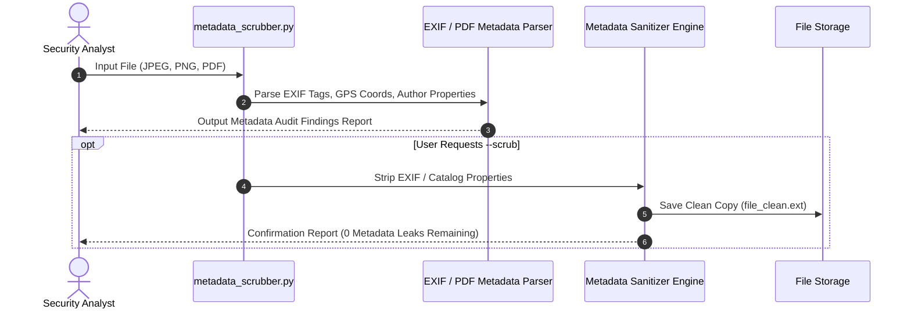

# Digital Exhaust & Metadata Privacy Analysis Toolkit

[](https://github.com/tahniatfarhan/digital-exhaust-analysis/actions/workflows/ci.yml)
[](https://github.com/tahniatfarhan/digital-exhaust-analysis/actions/workflows/codeql.yml)
[](https://cwe.mitre.org/data/definitions/200.html)
[](https://opensource.org/licenses/MIT)
[](https://www.python.org/)

> 🎓 **Academic Project Disclaimer:** This repository is an **educational laboratory project** developed for the Digital Forensics / Cyber Security course in the BS Cyber Security degree program at UET Lahore. It demonstrates metadata extraction, information disclosure risk auditing (CWE-200 / OWASP WSTG-INFO-005), and EXIF/PDF metadata scrubbing concepts.

---

## 📐 Metadata Audit & Scrubbing Workflow



---

## 🛡️ Key Cybersecurity & Privacy Concepts

1. **Digital Exhaust:** Residual data passively generated when using digital devices, smartphones, and software applications (e.g., GPS coordinates, camera serial numbers, device timestamps).
2. **Information Disclosure (CWE-200):** Unintended exposure of internal network account names, software versions, or physical GPS locations embedded inside public media files.
3. **Data Minimization & Privacy-by-Design:** Stripping non-essential tracking metadata prior to publishing or sharing files.

---

## 📊 Sample Metadata Extraction & Audit Output

### Image EXIF Leak Audit Sample
```
=======================================================
 METADATA AUDIT REPORT: photo_sample.jpg
=======================================================
 Format: JPEG
 Size: 4032x3024
 [EXIF_Tags]:
    - Make: Apple
    - Model: iPhone 13 Pro
    - DateTimeOriginal: 2024:05:15 14:22:10
    - Software: iOS 17.4
 [GPS_Coordinates]:
    - GPSLatitudeRef: N
    - GPSLatitude: 31.5708
    - GPSLongitudeRef: E
    - GPSLongitude: 74.3142  (Resolves to Lahore, Pakistan)
=======================================================
```

---

## 📁 Repository Structure

```
digital-exhaust-analysis/
├── .github/
│   ├── dependabot.yml              # Automated monthly dependency scanner
│   └── workflows/
│       ├── ci.yml                  # Python test workflow across 3.10, 3.11, 3.12
│       └── codeql.yml              # CodeQL Application Security Analysis
├── assets/
│   └── screenshots/                # Project research artifacts
├── docs/                           # Research papers & presentation slides
│   ├── Digital Exhaust Presentation.pptx
│   └── Metadata_Privacy_and_MAT2_Report.docx
├── src/
│   └── metadata_scrubber.py        # Python Metadata Audit & Scrubbing CLI Utility
├── tests/
│   └── test_scrubber.py            # Automated Pytest Unit Test Suite
├── CODE_OF_CONDUCT.md              # Contributor Code of Conduct
├── CONTRIBUTING.md                 # Contribution guidelines
├── LICENSE                         # MIT License
├── pyproject.toml                  # Python PEP 517/518 build configuration
├── README.md                       # Comprehensive Documentation & Forensics Guide
├── requirements.txt                # Dependencies (Pillow, PyPDF2, pytest)
└── SECURITY.md                     # Security & Privacy Policy
```

---

## 🛠️ Execution & Testing

### 1. Installation
```bash
git clone https://github.com/tahniatfarhan/digital-exhaust-analysis.git
cd digital-exhaust-analysis
pip install -r requirements.txt
```

### 2. Audit File Metadata
```bash
python src/metadata_scrubber.py sample_image.jpg
```

### 3. Audit & Scrub Metadata
```bash
python src/metadata_scrubber.py sample_image.jpg --scrub
# Output saved to: sample_image_clean.jpg
```

### 4. Run Automated Pytest Suite
```bash
pytest -v tests/
```

---

## 📄 License & Author

Distributed under the **MIT License**. See [`LICENSE`](LICENSE) for details.

**Author:** [Tahniat Farhan](https://github.com/tahniatfarhan) — BS Cyber Security, UET Lahore.
